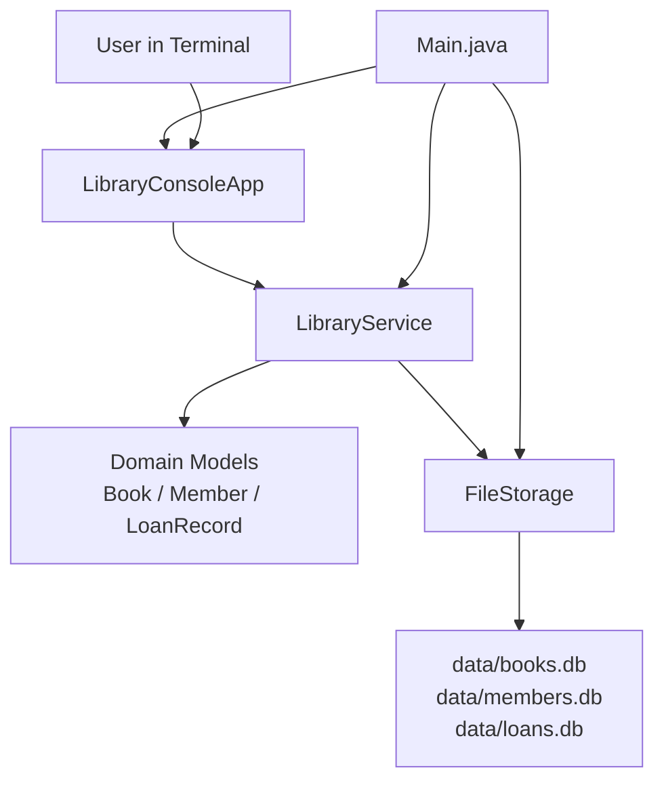
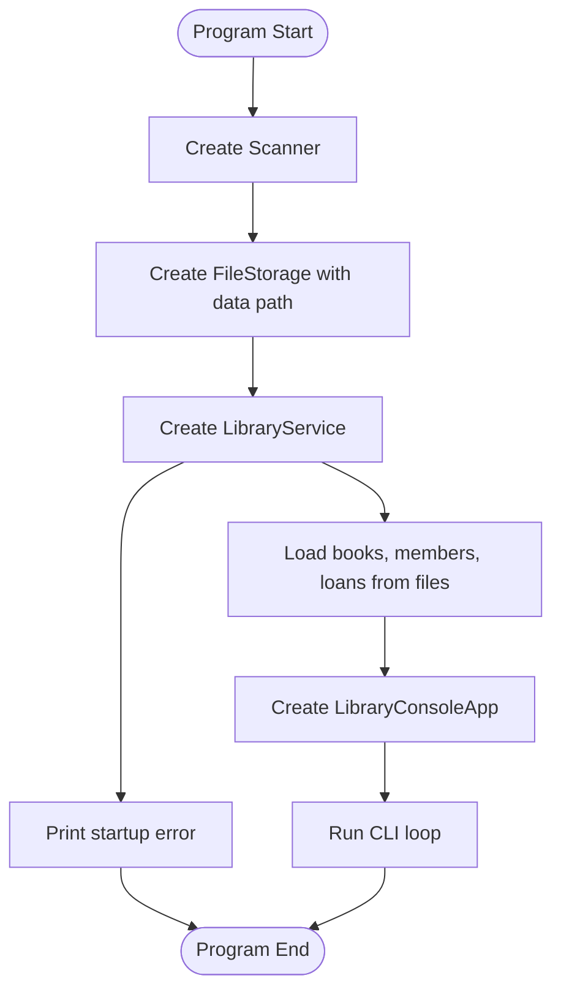
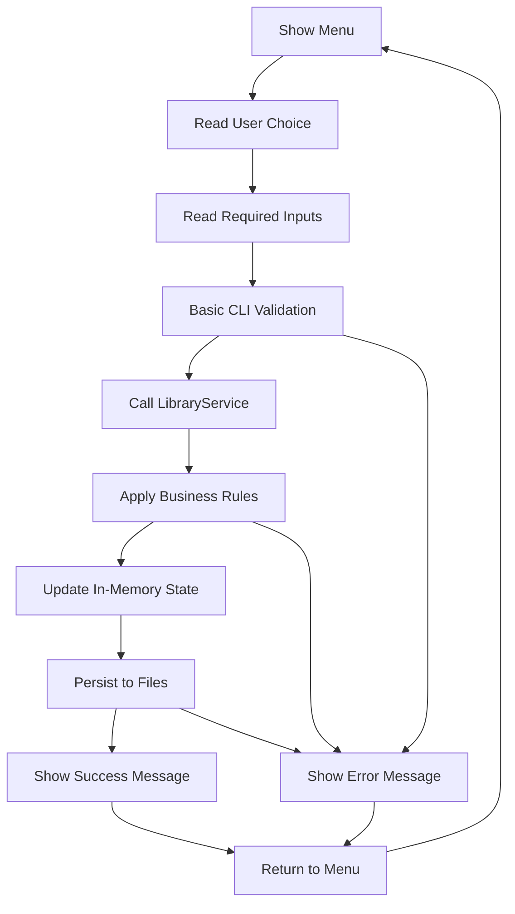
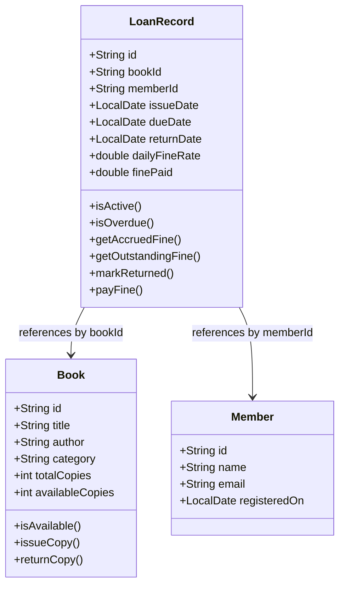
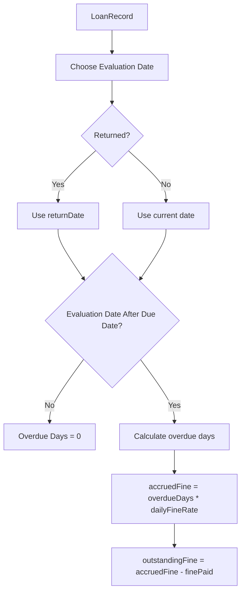
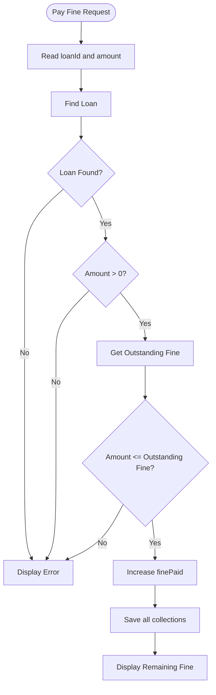
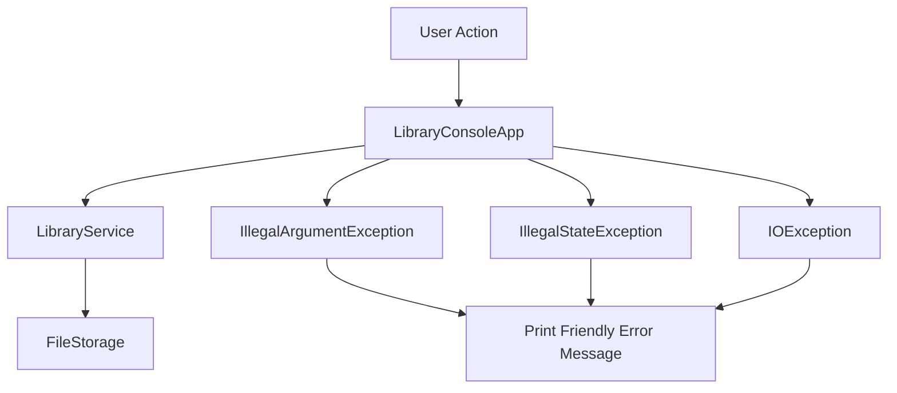
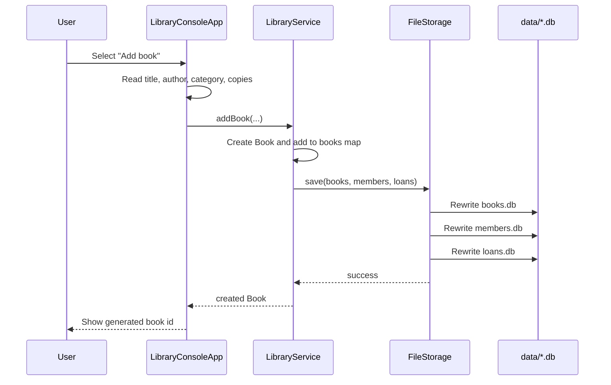

# Library Management System Architecture

This document explains the architecture of the Java CLI-based Library Management System, including its layers, component responsibilities, data flow, persistence strategy, and key operational flows.

## 1. Architecture Overview

The project follows a simple layered architecture suitable for a small command-line application:

- Presentation layer: handles terminal interaction
- Service layer: contains business rules and orchestration
- Domain model layer: represents core entities
- Storage layer: reads and writes data from flat files

The application is intentionally lightweight:

- no external framework
- no database server
- no REST API
- no dependency injection container

This makes the flow easy to understand and suitable for learning object-oriented design, layered architecture, and file-based persistence.

## 2. High-Level Architecture



## 3. Layer Responsibilities

### Presentation Layer

File:

- `src/librarymanagement/ui/LibraryConsoleApp.java`

Responsibilities:

- shows the menu
- accepts user input
- validates input format at the CLI level
- calls service methods
- displays results and error messages

The presentation layer does not directly read or write files and does not own business rules such as issue eligibility or fine restrictions.

### Service Layer

File:

- `src/librarymanagement/service/LibraryService.java`

Responsibilities:

- loads data on startup
- stores in-memory collections of books, members, and loans
- enforces business rules
- creates ids for new entities
- updates book availability
- coordinates fine calculation and payment
- persists data after every successful write operation

This is the core decision-making layer of the project.

### Domain Model Layer

Files:

- `src/librarymanagement/model/Book.java`
- `src/librarymanagement/model/Member.java`
- `src/librarymanagement/model/LoanRecord.java`

Responsibilities:

- represent the state of library entities
- validate object-level invariants
- expose behavior related to each entity

Examples:

- `Book` manages copy availability
- `Member` stores registration details
- `LoanRecord` manages due dates, return state, and fine calculations

### Storage Layer

File:

- `src/librarymanagement/storage/FileStorage.java`

Responsibilities:

- create the `data/` directory if needed
- load records from flat files
- parse records into domain objects
- serialize domain objects back to text files
- encode text fields safely for storage

The storage layer knows the file format, but it does not decide whether an operation is allowed.

## 4. Startup Flow

The startup process begins in `Main.java`, builds the storage and service objects, loads persisted data, and then starts the CLI loop.



## 5. Runtime Request Flow

Every menu-driven action follows roughly the same flow:



## 6. Menu Routing Flow

The CLI keeps all routing inside a single loop and delegates each option to a focused helper method.

```mermaid
flowchart TD
    Run[run()]
    Menu[printMenu()]
    Choice[readInt()]
    Switch{Menu Option}

    Run --> Menu
    Menu --> Choice
    Choice --> Switch

    Switch --> AddBook[addBook]
    Switch --> ListBooks[listBooks]
    Switch --> SearchBooks[searchBooks]
    Switch --> RemoveBook[removeBook]
    Switch --> RegisterMember[registerMember]
    Switch --> ListMembers[listMembers]
    Switch --> SearchMembers[searchMembers]
    Switch --> RemoveMember[removeMember]
    Switch --> IssueBook[issueBook]
    Switch --> ReturnBook[returnBook]
    Switch --> ActiveLoans[listLoans active]
    Switch --> OverdueLoans[listLoans overdue]
    Switch --> OutstandingFines[listLoans outstanding]
    Switch --> PayFine[payFine]
    Switch --> Exit[Exit]

    AddBook --> Menu
    ListBooks --> Menu
    SearchBooks --> Menu
    RemoveBook --> Menu
    RegisterMember --> Menu
    ListMembers --> Menu
    SearchMembers --> Menu
    RemoveMember --> Menu
    IssueBook --> Menu
    ReturnBook --> Menu
    ActiveLoans --> Menu
    OverdueLoans --> Menu
    OutstandingFines --> Menu
    PayFine --> Menu
```

## 7. In-Memory Data Architecture

`LibraryService` stores the application state in memory using three `LinkedHashMap` collections:

- `Map<String, Book> books`
- `Map<String, Member> members`
- `Map<String, LoanRecord> loans`

Why `LinkedHashMap` is useful here:

- preserves insertion order
- makes CLI listings predictable
- keeps saved output stable and readable

## 8. Domain Model Relationships

The project does not use object references between entities for persistence. Instead, `LoanRecord` stores ids:

- `bookId`
- `memberId`

This keeps the storage simple and reduces object graph complexity.



## 9. Book Issue Flow

Issuing a book is one of the most important flows because it touches validation, domain updates, and persistence.

```mermaid
flowchart TD
    Start([Issue Book Request])
    Input[Read bookId, memberId, loanDays, fineRate]
    FindBook[Find Book]
    FindMember[Find Member]
    BookExists{Book Found?}
    MemberExists{Member Found?}
    Available{Copies Available?}
    DuplicateLoan{Same Member Already Has Active Loan For This Book?}
    CreateLoan[Create LoanRecord]
    DecrementCopy[book.issueCopy()]
    SaveLoan[Put loan into loans map]
    Persist[Save all collections]
    Success[Display Success]
    Error[Display Error]

    Start --> Input
    Input --> FindBook
    FindBook --> BookExists
    BookExists -- No --> Error
    BookExists -- Yes --> FindMember
    FindMember --> MemberExists
    MemberExists -- No --> Error
    MemberExists -- Yes --> Available
    Available -- No --> Error
    Available -- Yes --> DuplicateLoan
    DuplicateLoan -- Yes --> Error
    DuplicateLoan -- No --> CreateLoan
    CreateLoan --> DecrementCopy
    DecrementCopy --> SaveLoan
    SaveLoan --> Persist
    Persist --> Success
```

## 10. Book Return and Fine Flow

Returning a book closes the active loan and restores book availability. Fine calculation remains available using the stored return date.

```mermaid
flowchart TD
    Start([Return Book Request])
    Input[Read loanId]
    FindLoan[Find Loan]
    Exists{Loan Found?}
    Returned{Already Returned?}
    FindBook[Find Related Book]
    MarkReturn[loan.markReturned(today)]
    IncrementCopy[book.returnCopy()]
    Persist[Save all collections]
    ShowFine{Outstanding Fine Exists?}
    FineMessage[Display Outstanding Fine]
    NoFine[Display No Fine]
    Error[Display Error]

    Start --> Input
    Input --> FindLoan
    FindLoan --> Exists
    Exists -- No --> Error
    Exists -- Yes --> Returned
    Returned -- Yes --> Error
    Returned -- No --> FindBook
    FindBook --> MarkReturn
    MarkReturn --> IncrementCopy
    IncrementCopy --> Persist
    Persist --> ShowFine
    ShowFine -- Yes --> FineMessage
    ShowFine -- No --> NoFine
```

## 11. Fine Calculation Flow

The fine system is centered in `LoanRecord`.

Rules:

- no fine before due date
- fine grows day by day while loan is active and overdue
- once returned, fine stops growing
- fine paid reduces outstanding fine
- overpayment is not allowed



## 12. Fine Payment Flow



## 13. Persistence Architecture

The storage layer uses three flat files:

- `books.db`
- `members.db`
- `loans.db`

Each successful write operation saves all three collections back to disk.

### Why This Design Works Here

- simple to understand
- no external database dependency
- easy to inspect manually
- easy to reset during development

### Tradeoff

- every save rewrites the whole file
- this is fine for small datasets but not ideal for large-scale systems

## 14. File Persistence Flow

```mermaid
flowchart TD
    SaveRequest[Service saveChanges()]
    CallStorage[Call FileStorage.save()]
    EnsureDir[Ensure data directory exists]
    SerializeBooks[Write books collection]
    SerializeMembers[Write members collection]
    SerializeLoans[Write loans collection]
    TruncateWrite[Overwrite existing files]
    Complete[Persistence Complete]

    SaveRequest --> CallStorage
    CallStorage --> EnsureDir
    EnsureDir --> SerializeBooks
    SerializeBooks --> SerializeMembers
    SerializeMembers --> SerializeLoans
    SerializeLoans --> TruncateWrite
    TruncateWrite --> Complete
```

## 15. Load Flow on Startup

```mermaid
flowchart TD
    Startup[LibraryService Constructor]
    Load[storage.load()]
    EnsureDir[Ensure data directory exists]
    ReadBooks[Read books.db]
    ReadMembers[Read members.db]
    ReadLoans[Read loans.db]
    Parse[Parse lines into objects]
    Validate[Validate duplicate ids and emails]
    PopulateMaps[Load data into LinkedHashMap collections]
    NextIds[Compute next BOOK / MEM / LOAN numbers]

    Startup --> Load
    Load --> EnsureDir
    EnsureDir --> ReadBooks
    ReadBooks --> ReadMembers
    ReadMembers --> ReadLoans
    ReadLoans --> Parse
    Parse --> Validate
    Validate --> PopulateMaps
    PopulateMaps --> NextIds
```

## 16. Storage Format Architecture

The system stores one record per line using `|` as a separator.

Formats:

- books: `bookId|title|author|category|totalCopies|availableCopies`
- members: `memberId|name|email|registeredOn`
- loans: `loanId|bookId|memberId|issueDate|dueDate|returnDate|dailyFineRate|finePaid`

Text fields are URL-encoded before saving. This protects the file structure from special characters that might otherwise break parsing.

## 17. Validation Architecture

Validation happens at multiple levels:

### CLI-Level Validation

Handled in `LibraryConsoleApp`:

- required text input
- numeric parsing for menu choices
- numeric parsing for fine amount and loan duration
- default values for optional loan days and fine rate

### Service-Level Validation

Handled in `LibraryService`:

- entity existence checks
- duplicate active loan prevention
- member email uniqueness
- safe delete rules
- issue and return orchestration

### Model-Level Validation

Handled in constructors and entity methods:

- valid copy counts in `Book`
- valid registration date in `Member`
- valid issue, due, and return dates in `LoanRecord`
- fine payment bounds in `LoanRecord`

## 18. Error Handling Architecture

The application uses exception-driven control flow for invalid operations.

### Error Sources

- invalid user input
- business rule violations
- corrupted or malformed file data
- file read/write failures

### Error Handling Flow



## 19. Sequence of a Typical Write Operation

Example: Add Book



## 20. Architectural Decisions

### Why a Layered Design

This separation keeps the project understandable:

- UI only handles interaction
- service handles rules and workflow
- models represent state and local behavior
- storage handles files only

### Why File-Based Persistence

This project is small enough that flat files are practical and easy to debug.

### Why IDs Instead of Object References in Files

This makes serialization simple and avoids recursive or nested object storage issues.

### Why Save After Every Successful Write

This reduces the chance of losing changes if the application closes unexpectedly.

## 21. Scalability and Limitations

This architecture is good for:

- small datasets
- single-user terminal usage
- academic projects
- introductory software architecture learning

This architecture is not ideal for:

- large-scale concurrent usage
- high write frequency
- partial transactional updates
- multi-user synchronization
- reporting-heavy systems

## 22. Possible Future Architecture Improvements

If the project grows, the architecture can evolve in these directions:

- add repository interfaces between service and storage
- replace flat files with SQLite or another relational database
- add DTOs and mappers if a web layer is introduced
- add unit and integration tests
- split fine logic into a dedicated fine service
- add audit logs for book issue and return history
- add role-based access if multiple operators are introduced

## 23. Summary

The project uses a clean and straightforward architecture:

- `Main` bootstraps the system
- `LibraryConsoleApp` manages user interaction
- `LibraryService` manages business logic and state
- `Book`, `Member`, and `LoanRecord` model the domain
- `FileStorage` manages persistence
- the `data/` files act as the backing store

The overall flow of the project is:

1. load persisted data
2. display the CLI menu
3. accept user input
4. validate and process through the service layer
5. update in-memory state
6. save to files
7. repeat until exit
